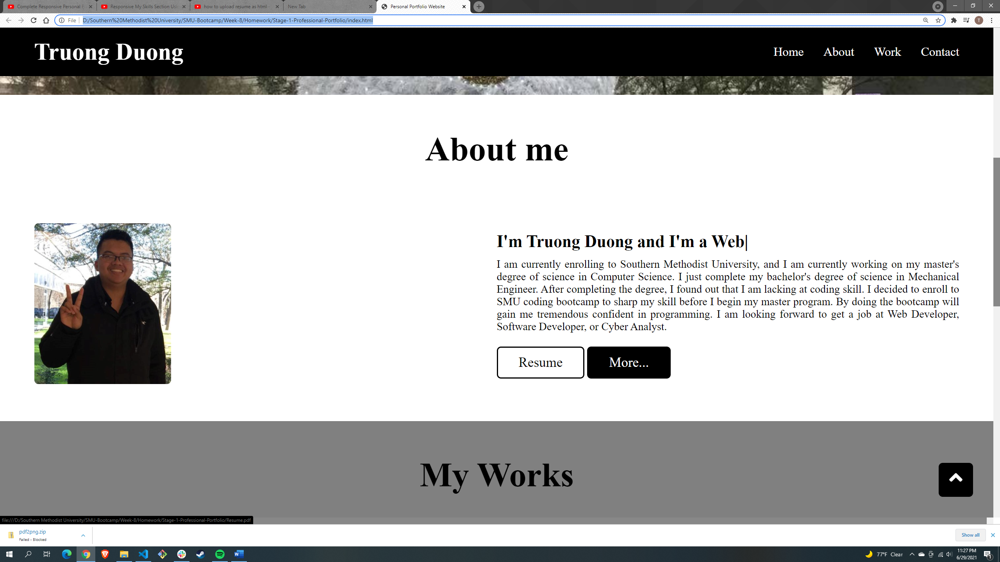
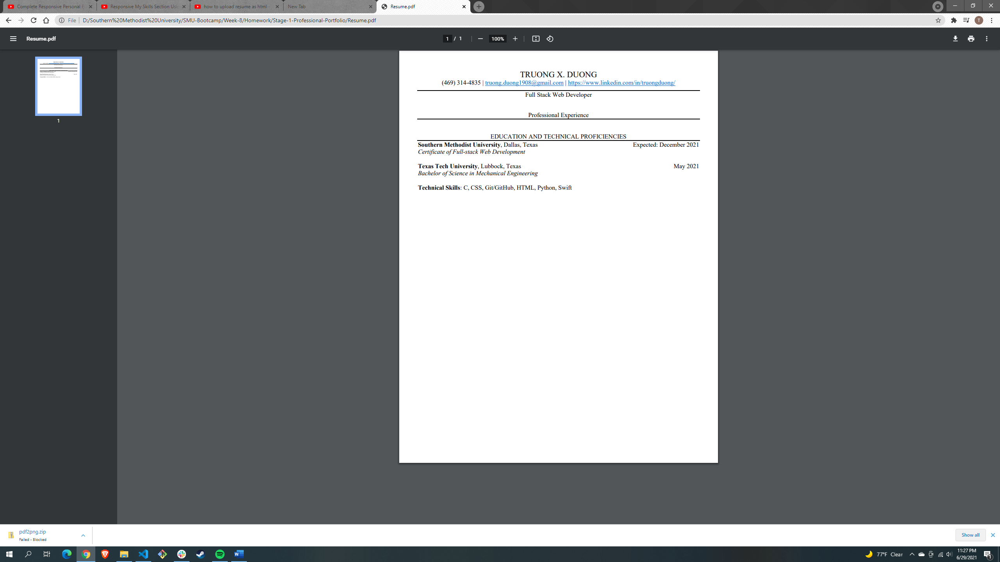
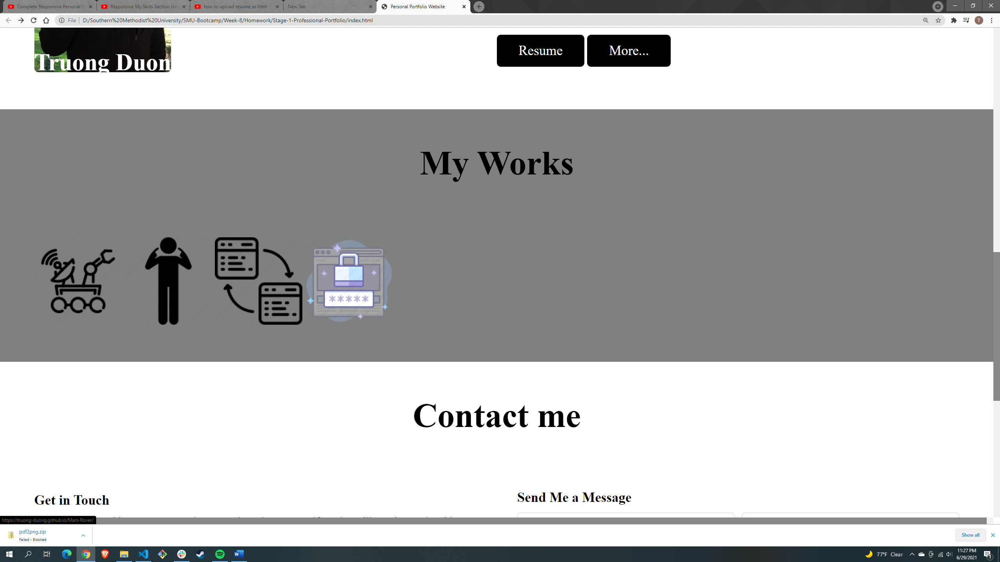
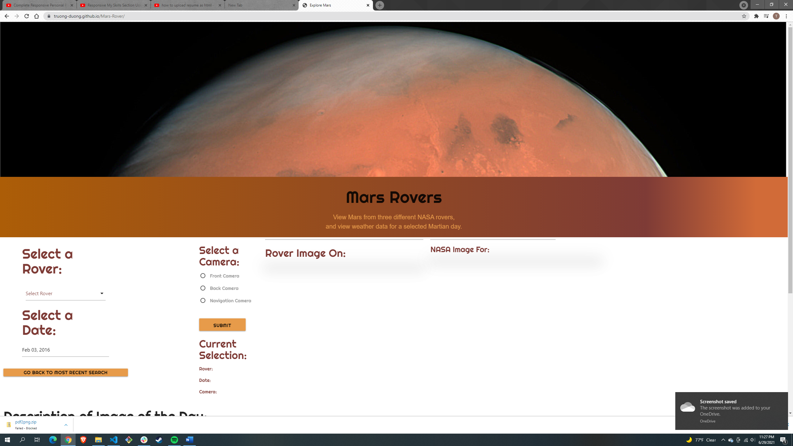
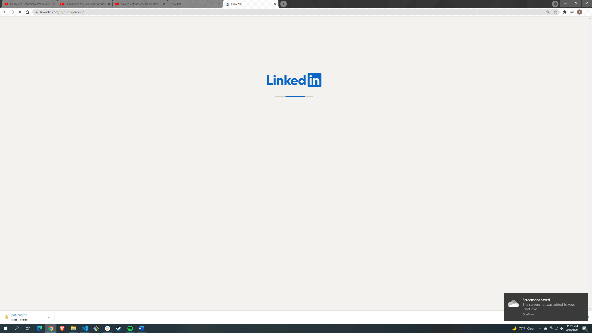
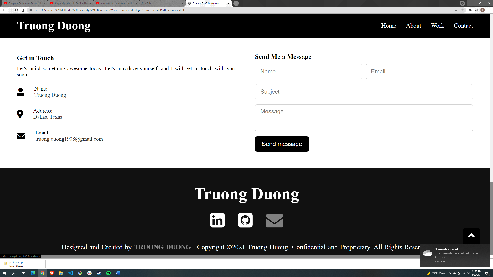
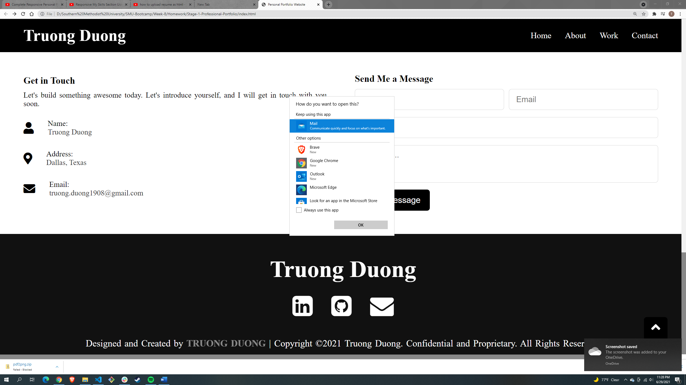

# Stage 1 Professional Protfolio
## Homework Requirements

* Updated portfolio featuring Project 1 and two exemplary homework assignments.

* Updated GitHub profile with pinned repositories featuring Project 1 and two exemplary assignments.

* Updated resume

* Updated LinkedIn profile

## Project Complete 

* Click the resume will pop up the resume.

* Click on the icon in the works section will pop up the homeword assignment.

* Click on the LinkedIn at the footer will bring you to my LinkedIn website.

* Click on the email icon to send me a message.

## Result

* Resume:

* Homework:

* LinkedIn

* Email

